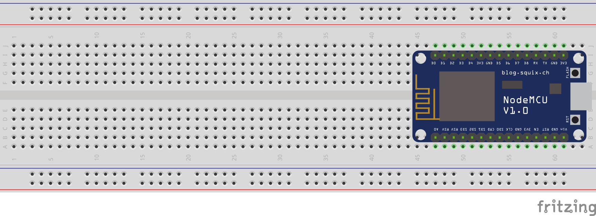

= IoT Hacknight - Sensors & Code

:Author:    Patrick Steiner
:Email:     psteiner@redhat.com
:Date:      23.01.2016

:toc: macro

toc::[]

== Purpose
This lab will introduce you into one of the many ways to develop a Sensor for
an Internet of Things scenario.

In this scenario we will be using the following hardware:

 * https://en.wikipedia.org/wiki/ESP8266[ESP6288] Microprocessor, mounted on a
 https://en.wikipedia.org/wiki/NodeMCU[NodeMCU]
 * https://www.adafruit.com/product/385[DHT22] sensor for temperature and humidity
 * https://en.wikipedia.org/wiki/Breadboard[Breadboard] for rapid hardware "prototyping"
 * https://en.wikipedia.org/wiki/USB#Mini_and_micro_connectors[USB-Kable] to connect the NodeMCU with your desktop
 * PC running Linux Desktop, Windows or MacOSX

[NOTE]
====
Participants in this lab are expected to have a general understanding of at least
one programming language, so that our source-examples do not need to be documented
line-by-line.
====

== Development environment
To be able to follow the Labs you will need to install the following software on your
desktop

 * https://www.arduino.cc/en/main/software[Arduino IDE]
 * https://www.silabs.com/products/development-tools/software/usb-to-uart-bridge-vcp-drivers[Serial to USB Driver]

Please make sure you have the right version for your desktop Operating system
downloaded and installed.

== Lab 1: Simple ESP8266 Program

=== Learnings
In this lab we will be getting acquainted with

 * writing a program for the ESP8266
 * flashing the program on the ESP8266

=== Hardware Setup
This lab will be very minimal on hardware. All you need is

* https://en.wikipedia.org/wiki/ESP8266[ESP6288] Microprocessor, mounted on a
https://en.wikipedia.org/wiki/NodeMCU[NodeMCU]
* https://en.wikipedia.org/wiki/Breadboard[Breadboard] for rapid hardware "prototyping"

Place your ESP8266 on the Breadboard, as shown in the picture

Connect the Micro-USB port of the NodeMCU with your desktop.

=== Software Setup
Please start your already installed https://www.arduino.cc/en/main/software[Arduino IDE].

You will have to add capabilities for the https://www.arduino.cc/en/main/software[Arduino IDE] to be able to build
and flash code for our ESP8266.

 * Open the preferences window from the https://www.arduino.cc/en/main/software[Arduino IDE]. Go to `File -> Preferences`
 * Enter http://arduino.esp8266.com/stable/package_esp8266com_index.json into Additional Board Manager URLs field and click the `OK` button

 * Open boards manager. Go to `Tools -> Board -> Boards Manager…`

 * Scroll down, select the ESP8266 board menu and install `esp8266 platform`

 * Re-Start your https://www.arduino.cc/en/main/software[Arduino IDE]

Now that we have the https://www.arduino.cc/en/main/software[Arduino IDE] prepared to
interact with your ESP8266, we only need to configure it accordingly.

 * Open the `Tools` menu and configure the https://www.arduino.cc/en/main/software[Arduino IDE]
 according to the following table

[width="80%",frame="topbot",options="header,footer"]
|============
|Parameter    |Value
|CPU Frequency | 80
|Flash Size | 4M (1M SPIFFS)
|Upload Speed |115200
|Port | <your USB-2-Serial port>
|============

=== Source-Code
Please transfer ( copy/paste, re-type, ... ) the following code on into your
https://www.arduino.cc/en/main/software[Arduino IDE]

[source,c++]
----
 String        message = "";      // message to display

 /* Functionname says it all! */
 void setup(void) {

   Serial.begin(115200);          // prepare serial for debug messages

   Serial.println("\n\rESP8266 started!");
 }

 /* Functionname says it all! */
 void loop(void) {
  message = "\n\rStill working";
  Serial.print(message);
  delay(1000);                    // Sleep a second
 }
----

=== Flashing the ESP8266
With the https://www.arduino.cc/en/main/software[Arduino IDE] installed and configured
and our code ( hopefully correctly ) transfered, the last step we need to take is to
flash the code onto the ESP8266.

To do this, please push the 'Flash' Button on the NodeMCU

this will reset the ESP8266 and will bring him into a mode where he expects a new
image to be flashed.

Build and flash the code via the https://www.arduino.cc/en/main/software[Arduino IDE]

Once the flash process has completed, the ESP8266 will restart and will automatically
start the new code.

image: ....

In our code we did write some statements via `Serial.println();``. To view these,
please open the Serial Monitor via the menu `Tools->Serial Monitor` and make sure
you have the same Baud-Rate configured as in the previous steps for the `Upload Speed`

=== Expected Outcome
Our code runs a simple endless-loop which write `Still working` with a 1 second
delay to the Serial output.

image: ...

== Lab 2: Blink

=== Learnings
As a first extension to our simple Program, we will introduce a way to let the
ESP8266 communicate with you. To make this "communication" simple, we will be
using a LED, which is already part of the NodeMCU board.

=== Hardware Setup
Same as in previous Lab

=== Software Setup
Same as in previous Lab

=== Source-Code
To not loose our previous code, please open a new "sketch" in your https://www.arduino.cc/en/main/software[Arduino IDE]
by selecting the menu `File->New`

Please transfer ( copy/paste, re-type, ... ) the following code

[source,c++]
----
String        message = "";

/************* Functionname says it all! ******************************/
void setup(void) {

  Serial.begin(115200);

  Serial.println("\n\rESP8266 started!");

  pinMode(BUILTIN_LED, OUTPUT);     // Initialize the BUILTIN_LED pin as an output
}

/************* Functionname says it all! ******************************/
void loop(void) {

  message = "\n\rLight On";
  Serial.print(message);
  digitalWrite(BUILTIN_LED, LOW);
  delay(1000);

  message = "\n\rLight Off";
  Serial.print(message);
  digitalWrite(BUILTIN_LED, HIGH);
  delay(1000);
}
----

As you can see, there is only need for very slight adjustments to our previous
code. All we need to do is

 * `pinMode(BUILTIN_LED, OUTPUT);` define the GPIO as outbound
 * `digitalWrite(BUILTIN_LED, LOW);` send a LOW-Signale to the GPIO to turn on LED
 * `digitalWrite(BUILTIN_LED, HIGH);` send a HIGH-Signale to the GPIO to turn on LED

[NOTE]
====
General-purpose input/output (GPIO) is a generic pin on an integrated
circuit or computer board whose behavior—including whether it is an
input or output pin—is controllable by the user at run time.
https://en.wikipedia.org/wiki/General-purpose_input/output
====

=== Flashing the ESP8266
Same as in previous Lab

=== Outcome
As in the previous Lab, you can use the `Serial Monitor`to view the messages
written to the Serial port. In Addition you should see the LED on the NodeMCU
changing it's state from "on" to "off" every second.

== Lab 3: Monitor Temperature and Humidity

=== Learnings

=== Hardware Setup

=== Software Setup

=== Source-Code

=== Flashing the ESP8266

=== Outcome
